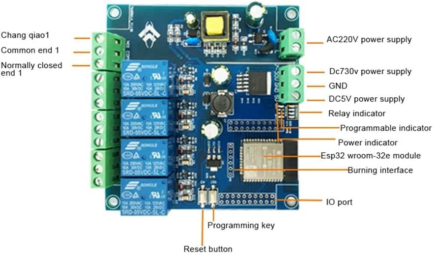

# HMI Based Waste Tank Controller

 **Description:**  
    This project is going to be installed in a car. The idea behind this project is to create a small, cost-effective project to control waste valves using a 4 channel ESP32 relay board and 3.5 inch Nextion touch screen display.

**Hardware Specifications:**
  Here is the picture of the customized control board
  

**Project Description:**

   1. There are two valves to control with 4 relays. 

   1. 1 channel will open valve A, another channel will close valve A

   1.  then the remaining 2 channels will open and close valve B.

   1. Valve A needs to be powered for 7 seconds to open it, and later powered for 7 seconds to close it.

   1. Valve B takes 5 seconds to open then 5 seconds to close.

   1. There are 2x dual state buttons on the nextion. Each button will open and close one valve. The screen also needs to display the time elapsed since each valve was last closed.
     Example: 
           Open - time tracking started 
           Close - time tracking continues
           Open - time tracking starts again from 0

   1. I would like the coding to trigger an audible alarm if either valve has not been closed for over 12 hours.

   1. ESP32 is also receiving power to a particular pin. This project is going to be installed in a car. When the car is running it will be sending power to this pin and I only want the audible alarm to go off when the car is running and its been over 12 hours since either valve has been closed.

**Task Informations:**
- [x] A proper controlling HMI Design
- [x] Valve A 7 seconds open close control 
- [x] Valve B 5 seconds open close control 
- [x] Elapse time tracking
- [x] Trigger Alerm after 12 hours elapse time
- [x] The audible alarm to go off when the car is running and its been over 12 hours since either valve has been closed.

 
